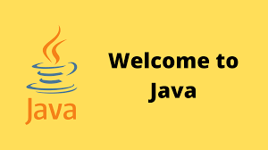

# reading-notes

This website is a collection of my observations and questions from the reading assignments throughout my course.

## Code 102 - Intro to Software Development

## Code 201 - Foundations of Software Development

## Code 301 - Intermediate Software Development

## Code 401 - Advanced Software Development

Topics will covere in advance :
- backend in java
- android studio

### this is my github account(reading-notes) : [GITHUB ACCOUNT](https://github.com/mosubborini2000/reading-notes)
 

| Item                      | Link                                     |
|---------------------------|------------------------------------------|
| SQL Training              | [sql training](./prac.md)                |
| Command Line Summarize    | [command line summarize](./comm.md)      |
| Data Structures & Algorithms | [DATASTRUCTURE AND ALGORITHMS](./datastru.md) |
| Java Basics               | [java basic](./javaBasics.md)            |
| Growth Mindset            | [growth mindest](./growth.md)           |
|  class                 | [reading1](./classOne.md)           | 
|  class2                  | [reading2](./classTwo.md)           |

 

