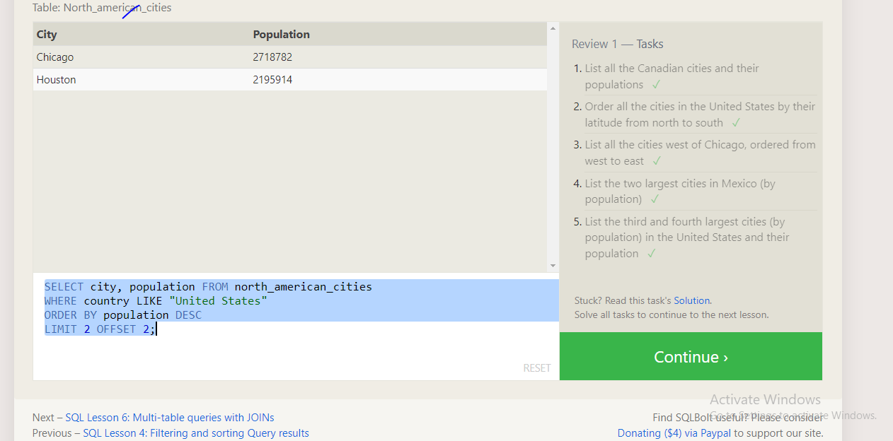

## sql polt
##### what  I learned :
SQL (Structured Query Language) is a powerful programming language used to manage and manipulate relational databases. It allows you to interact with databases to retrieve, insert, update, and delete data.

Database: A structured collection of data stored in tables, where each table represents a specific entity, and each row in the table represents a record.
Table: A two-dimensional structure composed of rows (records) and columns (fields) that define the data types and constraints for each field.
Query: A SQL command used to retrieve specific data from the database. The basic SELECT statement is used for this purpose.
Filtering: The use of the WHERE clause in a SQL query to filter data based on specific conditions.
Inserting Data: The INSERT INTO statement is used to add new records to a table.
Updating Data: The UPDATE statement is used to modify existing records in a table.
Deleting Data: The DELETE statement is used to remove records from a table.
Aggregating Data: SQL offers aggregate functions like COUNT, SUM, AVG, MIN, and MAX to perform calculations on data.
Joining Tables: SQL enables you to combine data from multiple tables using different types of joins (INNER JOIN, LEFT JOIN, RIGHT JOIN, FULL JOIN).

